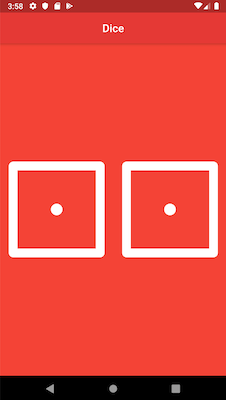

# Dice

A simple Flutter project for training. 

*It is time to rolling dice!!!*

## Getting Started

This project is a starting point for a training Flutter application.

Just click in one of two dices to rolling. You will receive a new result every time that you click! 

I will improve this app in the future!

### A few resources to get you started if this is your first Flutter project:

- [Lab: Write your first Flutter app](https://flutter.dev/docs/get-started/codelab)
- [Cookbook: Useful Flutter samples](https://flutter.dev/docs/cookbook)

For help getting started with Flutter, view our
[online documentation](https://flutter.dev/docs), which offers tutorials,
samples, guidance on mobile development, and a full API reference.
